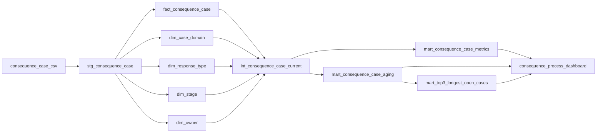

# LINEAGE.md

Project: Consequence Process Dashboard  
Document ID: lineage  
Priority: P1  
Depends on: METRIC_LOGIC.md, PIPELINE_SPEC.md, DATA_MODEL_SPEC.md, DASHBOARD_SPEC.md

## Metric-to-Source Traces

### Complete Trace



| Metric | Source Columns | Transform | Output | Dashboard |
|---|---|---|---|---|
| `metric_total_cases` | `case_id` | distinct count | `mart_consequence_case_metrics` | KPI card |
| `metric_closed_cases` | `case_id`, `stage` | approved closed-rule + distinct count | `mart_consequence_case_metrics` | KPI card |
| `metric_open_cases` | `case_id`, `stage` | approved open-rule + distinct count | `mart_consequence_case_metrics` | KPI card |
| `metric_open_cases_by_stage` | `case_id`, `stage` | approved open-rule + group by stage | `mart_consequence_case_metrics` | bar |
| `metric_days_in_current_stage` | `case_id`, `stage`, `stage_entered_date` + approved `reference_date` | approved date-diff logic | `mart_consequence_case_aging` | table |
| `metric_top_3_longest_open_cases` | aging output + `case_id` | sort desc + approved tie-break + limit 3 | `mart_top3_longest_open_cases` | Top 3 table |

### Column-level Trace for P0 KPI Paths

`consequence_process_completion_rate`
```text
CSV.case_id → stg_consequence_case.case_id → fact_consequence_case.case_id
→ int_consequence_case_current.case_id → metric_total_cases

CSV.stage → stg_consequence_case.stage → dim_stage.stage → int_consequence_case_current.stage
→ approved closed-rule → metric_closed_cases
→ consequence_process_completion_rate
```

`open_case_rate`
```text
CSV.case_id → fact_consequence_case.case_id → int_consequence_case_current.case_id
CSV.stage → dim_stage.stage → int_consequence_case_current.stage
→ approved open-rule → metric_open_cases
→ open_case_rate
```

## Table-level Lineage

| Upstream | Downstream | Relationship |
|---|---|---|
| `consequence_case_csv` | `stg_consequence_case` | validated full snapshot ingestion |
| `stg_consequence_case` | `dim_case_domain` | distinct `case_domain` |
| `stg_consequence_case` | `dim_response_type` | distinct `response_type` |
| `stg_consequence_case` | `dim_stage` | distinct `stage` |
| `stg_consequence_case` | `dim_owner` | distinct `owner` |
| `stg_consequence_case` | `fact_consequence_case` | validated row mapping + dimension key resolution |
| fact/dim tables | `int_consequence_case_current` | semantic joins |
| `int_consequence_case_current` | `mart_consequence_case_metrics` | aggregate metrics |
| `int_consequence_case_current` | `mart_consequence_case_aging` | per-case aging |
| `mart_consequence_case_aging` | `mart_top3_longest_open_cases` | ranked Top 3 |
| metric marts | `consequence_process_dashboard` | presentation only; no formula duplication |

## Impact Analysis Matrix

Blast Radius Score = จำนวน affected metrics × จำนวน affected dashboards

Core source systems จาก `PIPELINE_SPEC.md`:
1. `consequence_case_csv`
2. optional AI endpoint — ไม่เป็น source ของ core metrics

| Source / Change | Affected Metrics | Affected Dashboards | Blast Radius Score | Primary Impact |
|---|---:|---:|---:|---|
| remove/rename `case_id` | 6 | 1 | 6 | grain, counts, ranking fail |
| change `case_domain` semantics | 6 | 1 | 6 | global filter population changes |
| change `stage` semantics/allowed values | 5 | 1 | 5 | open/closed and stage aggregation affected |
| change `stage_entered_date` type/meaning | 2 | 1 | 2 | aging + Top 3 fail |
| change `owner` semantics | 1 | 1 | 1 | Top 3/case table context affected |
| optional AI endpoint unavailable | 0 core metrics | 0 core dashboards | 0 | bonus brief only |

Impact Analysis มองไปข้างหน้า; lineage มองย้อนกลับ จึงห้ามใช้ตาราง lineage แทน blast-radius assessment

## Breaking Change Impact

### Breaking Change Assessment Template

```text
Proposed Change:
Owner:
Effective Date:
Contract Version:

1. Upstream object changed:
2. Columns / grain affected:
3. Metrics affected:
4. Dashboards/reports affected:
5. Tests affected:
6. PDPA/access impact:
7. Historical comparison impact:
8. Contract notice completed:
9. Migration plan:
10. Rollback plan:
11. Approver:
```

### Downstream Consumer Checklist

ก่อน breaking change ต้องตรวจ:
- `DATA_CONTRACT.md`
- `DATA_MODEL_SPEC.md`
- `METRIC_SPEC.md`
- `METRIC_LOGIC.md`
- `PIPELINE_SPEC.md`
- `DATA_QUALITY.md`
- `TESTING_STRATEGY.md`
- `DASHBOARD_SPEC.md`
- `REPORT_SPEC.md`
- `ANALYTICS_CHANGELOG.md`
- optional AI feature/model docs ถ้าใช้ affected features

### Rollback Rule

- preserve previous valid contract/model revision
- preserve previous valid DuckDB/published state เมื่อทำได้
- rollback code/schema พร้อมกันเมื่อ incompatibility เป็น breaking
- rerun blocking tests ก่อน republish
- historical metric change ต้องตัดสินใจว่าจะ restate หรือคง old/new definitions คู่กัน และบันทึกใน `ANALYTICS_CHANGELOG.md`
