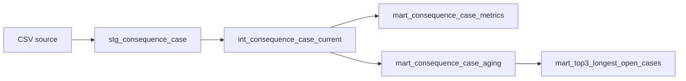

# METRIC_LOGIC.md

Project: Consequence Process Dashboard  
Document ID: metric_logic  
Priority: P0  
Depends on: METRIC_SPEC.md, DATA_MODEL_SPEC.md

## Metric SQL Implementations

เอกสารนี้เป็น source of truth ของ SQL logic สำหรับ metrics ที่ประกาศใน `METRIC_SPEC.md`
ทุก `metric_id` ด้านล่างต้องตรงกับ `METRIC_SPEC.md` ทุกประการ

> สถานะปัจจุบัน (2026-10-02): open/closed mapping, day-count convention, Top-3 tie-break และ
> `reference_date` ได้รับ approval แล้วในฐานะ project-specific approved business rule สำหรับงานสอบนี้ (ไม่ใช่ industry standard)
> metric ทั้ง 6 ตัวใน `METRIC_SPEC.md` เป็น `certified` และ SQL ด้านล่างตรงกับ implementation
> ที่ผ่าน validation test; ห้ามแทนค่ากติกาเหล่านี้ด้วยการเดาและห้ามใช้ `CURRENT_DATE`/system date

### Shared Runtime Inputs

ก่อนรัน metrics ที่พึ่ง business resolution ต้องมี inputs ต่อไปนี้:

- `approved_reference_date` — ค่า DATE ที่อนุมัติ; สำหรับงานสอบ = `2026-10-01` (project-specific exam assumption ไม่ใช่ industry standard; ส่งเป็น runtime input ไม่ hard-code ใน SQL และไม่ใช้ `CURRENT_DATE`)
- `approved_open_stage_values` — รายการ `stage` ที่อนุมัติว่าเป็น open
- `approved_closed_stage_values` — รายการ `stage` ที่อนุมัติว่าเป็น closed
- `approved_day_count_mode` — กติกานับวัน
- `approved_top3_tie_break` — กติกา deterministic tie-break

ค่าที่อนุมัติสำหรับงานสอบนี้ (ส่งเข้า runtime ผ่าน `config/runtime_config.json` / `CPD_REFERENCE_DATE`; ไม่ hard-code ใน SQL):

| Runtime input | ค่าที่อนุมัติ |
|---|---|
| `approved_reference_date` | `2026-10-01` |
| `approved_open_stage_values` | `reviewing`, `follow_up`, `collecting_info` |
| `approved_closed_stage_values` | `closed` |
| `approved_day_count_mode` | `calendar_day_difference` (`DATE_DIFF('day', stage_entered_date, reference_date)`) |
| `approved_top3_tie_break` | `case_id ASC` |

หาก `approved_reference_date` ไม่ถูกส่งเข้ามา metric ที่พึ่งมันต้องเป็น pending/unavailable (ไม่ default)

### Shared Base Model — `int_consequence_case_current`

**Source tables:**  
`fact_consequence_case`, `dim_case_domain`, `dim_response_type`, `dim_stage`, `dim_owner`

**Join logic:**

```sql
SELECT
    f.case_id,
    dcd.case_domain,
    drt.response_type,
    ds.stage,
    f.stage_entered_date,
    do.owner
FROM fact_consequence_case AS f
JOIN dim_case_domain AS dcd
    ON f.case_domain_key = dcd.case_domain_key
JOIN dim_response_type AS drt
    ON f.response_type_key = drt.response_type_key
JOIN dim_stage AS ds
    ON f.stage_key = ds.stage_key
JOIN dim_owner AS do
    ON f.owner_key = do.owner_key;
```

**Materialization:** `view`

**Filter contract:** dashboard อาจส่ง `case_domain` filter เข้ามา แต่ base model ไม่ hard-code
`behavior` หรือ `performance` เอง

---

### `metric_total_cases`

**Source tables:** `int_consequence_case_current`  
**Join logic:** none after shared base model  
**WHERE filters:** optional `case_domain` filter  
**GROUP BY grain:** `1 validated dataset snapshot × 1 filter context`

```sql
SELECT
    COUNT(DISTINCT case_id) AS metric_total_cases
FROM int_consequence_case_current
WHERE (:case_domain IS NULL OR case_domain = :case_domain);
```

**Edge cases:**
- duplicate source rows: ใช้ `COUNT(DISTINCT case_id)` ตาม `METRIC_SPEC.md`
- missing `case_id`: record ต้องถูก reject ก่อนเข้ามาใน fact table ตาม future `DATA_CONTRACT.md`
- empty snapshot: คืนค่า `0`

---

### `metric_closed_cases`

**Source tables:** `int_consequence_case_current`  
**Join logic:** none after shared base model  
**WHERE filters:** optional `case_domain`; approved closed-stage rule  
**GROUP BY grain:** `1 validated dataset snapshot × 1 filter context`

SQL นี้ใช้ runtime relation `approved_closed_stage_values(stage)` ที่ต้องสร้างจาก business resolution
ที่อนุมัติแล้วเท่านั้น:

```sql
SELECT
    COUNT(DISTINCT c.case_id) AS metric_closed_cases
FROM int_consequence_case_current AS c
JOIN approved_closed_stage_values AS r
    ON c.stage = r.stage
WHERE (:case_domain IS NULL OR c.case_domain = :case_domain);
```

**Guard:** `approved_closed_stage_values` = `closed` (approved); ถ้า relation ไม่มี rows ต้องถือว่า
runtime input ไม่พร้อมและห้ามแสดงผลเป็นค่าที่ใช้ได้

---

### `metric_open_cases`

**Source tables:** `int_consequence_case_current`  
**Join logic:** none after shared base model  
**WHERE filters:** optional `case_domain`; approved open-stage rule  
**GROUP BY grain:** `1 validated dataset snapshot × 1 filter context`

```sql
SELECT
    COUNT(DISTINCT c.case_id) AS metric_open_cases
FROM int_consequence_case_current AS c
JOIN approved_open_stage_values AS r
    ON c.stage = r.stage
WHERE (:case_domain IS NULL OR c.case_domain = :case_domain);
```

**Guard:** `approved_open_stage_values` = `reviewing`, `follow_up`, `collecting_info` (approved); ถ้า relation
ไม่มี rows ต้องถือว่า runtime input ไม่พร้อมและห้ามแสดงผลเป็นค่าที่ใช้ได้

---

### `metric_open_cases_by_stage`

**Source tables:** `int_consequence_case_current`  
**Join logic:** join กับ approved open-stage runtime relation  
**WHERE filters:** optional `case_domain`  
**GROUP BY grain:** `1 stage × 1 validated dataset snapshot`

```sql
SELECT
    c.stage,
    COUNT(DISTINCT c.case_id) AS metric_open_cases_by_stage
FROM int_consequence_case_current AS c
JOIN approved_open_stage_values AS r
    ON c.stage = r.stage
WHERE (:case_domain IS NULL OR c.case_domain = :case_domain)
GROUP BY c.stage
ORDER BY c.stage;
```

---

### `metric_days_in_current_stage`

**Source tables:** `int_consequence_case_current`  
**Join logic:** join กับ approved open-stage runtime relation  
**WHERE filters:** approved open-stage rule, valid `stage_entered_date`, optional `case_domain`  
**GROUP BY grain:** `1 case × 1 approved reference_date`

day-count convention ที่อนุมัติคือ **calendar-day difference** (ไม่รวมวันเริ่มต้น) เท่านั้น:

```sql
SELECT
    c.case_id,
    c.case_domain,
    c.response_type,
    c.stage,
    c.stage_entered_date,
    c.owner,
    DATE_DIFF(
        'day',
        c.stage_entered_date,
        CAST(:approved_reference_date AS DATE)
    ) AS metric_days_in_current_stage
FROM int_consequence_case_current AS c
JOIN approved_open_stage_values AS r
    ON c.stage = r.stage
WHERE c.stage_entered_date IS NOT NULL
  AND (:case_domain IS NULL OR c.case_domain = :case_domain);
```

**Certification guard:**
- approved rule เป็น calendar-day difference จึงตรงกับ SQL นี้; หากเปลี่ยนเป็น business-day ต้องแก้ SQL และบันทึกใน `ANALYTICS_CHANGELOG.md` ก่อน
- ถ้า `approved_reference_date` เป็น `null` ห้ามคำนวณด้วย `CURRENT_DATE`
- ถ้า `stage_entered_date > approved_reference_date` record ต้องถูก flag เป็น invalid ไม่แปลงเป็น
  zero โดยอัตโนมัติ

---

### `metric_top_3_longest_open_cases`

**Source model:** result ของ `metric_days_in_current_stage` logic  
**Join logic:** inherited from case-aging model  
**WHERE filters:** same filter context as dashboard  
**GROUP BY grain:** `1 ranked case × 1 approved reference_date`

approved tie-break คือ `case_id ASC` และ SQL ที่ใช้คือ:

```sql
WITH aged AS (
    SELECT
        c.case_id,
        c.case_domain,
        c.response_type,
        c.stage,
        c.stage_entered_date,
        c.owner,
        DATE_DIFF(
            'day',
            c.stage_entered_date,
            CAST(:approved_reference_date AS DATE)
        ) AS metric_days_in_current_stage
    FROM int_consequence_case_current AS c
    JOIN approved_open_stage_values AS r
        ON c.stage = r.stage
    WHERE c.stage_entered_date IS NOT NULL
      AND (:case_domain IS NULL OR c.case_domain = :case_domain)
)
SELECT
    case_id,
    case_domain,
    response_type,
    stage,
    stage_entered_date,
    owner,
    metric_days_in_current_stage
FROM aged
ORDER BY
    metric_days_in_current_stage DESC,
    case_id ASC
LIMIT 3;
```

**Certification:** tie-break `case_id ASC` ได้รับ approval (2026-10-02) และ metric validation MV-006 ผ่าน
จึงเป็น `certified` ใน `METRIC_SPEC.md`

---

### Derived KPI SQL

#### `consequence_process_completion_rate`

```sql
SELECT
    CASE
        WHEN total_cases = 0 THEN NULL
        ELSE closed_cases::DOUBLE / total_cases
    END AS consequence_process_completion_rate
FROM (
    SELECT
        COUNT(DISTINCT c.case_id) AS total_cases,
        COUNT(DISTINCT CASE WHEN r.stage IS NOT NULL THEN c.case_id END) AS closed_cases
    FROM int_consequence_case_current AS c
    LEFT JOIN approved_closed_stage_values AS r
        ON c.stage = r.stage
    WHERE (:case_domain IS NULL OR c.case_domain = :case_domain)
);
```

#### `open_case_rate`

```sql
SELECT
    CASE
        WHEN total_cases = 0 THEN NULL
        ELSE open_cases::DOUBLE / total_cases
    END AS open_case_rate
FROM (
    SELECT
        COUNT(DISTINCT c.case_id) AS total_cases,
        COUNT(DISTINCT CASE WHEN r.stage IS NOT NULL THEN c.case_id END) AS open_cases
    FROM int_consequence_case_current AS c
    LEFT JOIN approved_open_stage_values AS r
        ON c.stage = r.stage
    WHERE (:case_domain IS NULL OR c.case_domain = :case_domain)
);
```

## Edge Case Handling

Template กำหนดให้ครอบคลุม 5 กลุ่ม edge case ต่อไปนี้ แม้บางกลุ่มจะไม่ applicable กับข้อมูล HR ชุดนี้

### 1. Mid-month churn

**Applicability:** not applicable — ไม่มี subscription, churn หรือ monthly recurring revenue ใน
Consequence Process dataset

**SQL guard:**

```sql
SELECT COUNT(*) AS forbidden_churn_fields
FROM information_schema.columns
WHERE table_name IN ('fact_consequence_case')
  AND lower(column_name) IN ('churn_date', 'mrr', 'subscription_id');
```

Expected result สำหรับ model นี้ = `0`  
หาก schema ในอนาคตเพิ่ม billing/churn concept ต้องออกแบบ metric ใหม่ ไม่ reuse case-aging logic นี้

### 2. Proration on plan change

**Applicability:** not applicable — ไม่มี plan, price หรือ billing period ใน model

**SQL guard:**

```sql
SELECT COUNT(*) AS forbidden_proration_fields
FROM information_schema.columns
WHERE table_name = 'fact_consequence_case'
  AND lower(column_name) IN ('plan_id', 'price', 'billing_period', 'proration_amount');
```

Expected result = `0`

### 3. Null / missing values

สำหรับ fields ที่ metric พึ่งโดยตรง ห้าม silently coalesce เป็นค่าธุรกิจ

```sql
SELECT
    SUM(CASE WHEN case_id IS NULL THEN 1 ELSE 0 END) AS null_case_id,
    SUM(CASE WHEN stage_entered_date IS NULL THEN 1 ELSE 0 END) AS null_stage_entered_date
FROM fact_consequence_case;
```

Rules:
- `case_id IS NULL` → reject record ก่อน metric layer
- `stage_entered_date IS NULL` → exclude จาก aging metric และ report validation failure
- missing dimension join → reject/flag referential-integrity failure
- `reference_date IS NULL` → aging metrics must not run

### 4. Currency conversion

**Applicability:** not applicable — model ไม่มี monetary field

**SQL guard:**

```sql
SELECT COUNT(*) AS monetary_columns
FROM information_schema.columns
WHERE table_name = 'fact_consequence_case'
  AND (
      lower(column_name) LIKE '%amount%'
      OR lower(column_name) LIKE '%currency%'
      OR lower(column_name) LIKE '%price%'
  );
```

Expected result = `0`  
หาก model เพิ่ม monetary metric ภายหลัง ต้องกำหนด currency source, FX date และ conversion rule ก่อนใช้

### 5. Backdated / late-arriving records

สำหรับ snapshot CSV ปัจจุบัน backdated record หมายถึง record ที่ `stage_entered_date`
อยู่หลัง approved `reference_date` หรือ source snapshot ถูกนำเข้าซ้ำพร้อมค่าที่เปลี่ยน

Validation SQL:

```sql
SELECT
    case_id,
    stage_entered_date
FROM fact_consequence_case
WHERE stage_entered_date > CAST(:approved_reference_date AS DATE);
```

Expected result = `0 rows`

Restatement policy:
- ห้ามแก้ metric history แบบเงียบ ๆ
- หากโหลด snapshot เดิมใหม่และ source value เปลี่ยน ต้องบันทึก load identifier / audit evidence
  ใน pipeline layer
- metric ของ dashboard ใช้ snapshot ที่ validated ล่าสุดตาม run ที่เลือก
- historical restatement policy จริงยังต้องกำหนดใน downstream governance/changelog docs

## Transformation Dependencies

### DAG



### Model Dependency Matrix

| Model | Layer | Materialization | Depends On | Purpose |
|---|---|---|---|---|
| `stg_consequence_case` | staging | `table` | validated CSV | parse source types, preserve source values, enforce required-column presence |
| `int_consequence_case_current` | intermediate | `view` | `fact_consequence_case`, `dim_case_domain`, `dim_response_type`, `dim_stage`, `dim_owner` | resolve dimensions into analysis-ready current-case rows |
| `mart_consequence_case_metrics` | mart | `view` | `int_consequence_case_current`, approved open/closed stage runtime relations | total/open/closed and open-by-stage metrics |
| `mart_consequence_case_aging` | mart | `view` | `int_consequence_case_current`, approved open-stage runtime relation, approved `reference_date` | per-case aging logic |
| `mart_top3_longest_open_cases` | mart | `view` | `mart_consequence_case_aging`, approved tie-break | deterministic Top 3 output |

### Materialization Strategy

- `stg_consequence_case` = `table` เพราะเป็น validated snapshot ที่ต้องตรวจซ้ำและใช้เป็นหลักฐานของ run
- `int_consequence_case_current` = `view` เพราะเป็น join/semantic projection จาก analytics model
- mart metrics = `view` ในขอบเขตข้อสอบ เพื่อลด duplication ของ metric formula
- ไม่มี incremental materialization ใน core exam scope เพราะ source เป็น snapshot CSV และยังไม่มี
  approved incremental/load-history contract
- dashboard ห้ามคำนวณสูตร metric ซ้ำเอง ต้อง query mart/view ที่ implement logic จากเอกสารนี้

### Dependency Rule

`METRIC_SPEC.md` เป็นเจ้าของความหมายของ metric ว่า “วัดอะไร”  
`METRIC_LOGIC.md` เป็นเจ้าของ implementation ว่า “คำนวณอย่างไร”  
`DATA_MODEL_SPEC.md` เป็นเจ้าของ table/grain ที่ SQL อ้างอิง

หาก SQL, dashboard หรือ application layer มีสูตรที่ขัดกับเอกสารนี้ ให้ถือเป็น defect และแก้ที่
source of truth ก่อน

## Implementation Reconciliation (2026-10-02)

SQL ด้านบนตรงกับ implementation ที่ผ่าน test (`sql/metrics.sql`, `sql/views.sql`, `sql/aging_views.sql`) — **สูตรไม่ถูกเปลี่ยน** ความต่างมีเฉพาะรูปแบบการเขียน:

- named parameter เขียนเป็น `$case_domain` (DuckDB Python) แทน `:case_domain` และ cast เป็น `$case_domain::VARCHAR` เพื่อรองรับค่า `NULL` (unfiltered)
- runtime relations `approved_open_stage_values`, `approved_closed_stage_values` และ `runtime_inputs` (reference_date, day_count_mode, top3_tie_break) ถูก materialize เป็น table ต่อ run จาก config
- `mart_consequence_case_aging` อ่าน `reference_date` จาก `runtime_inputs` และถูกสร้างเมื่อมี approved `reference_date` และ DQ-004 ผ่านเท่านั้น; `metric_days_in_current_stage` และ Top 3 query จาก mart นี้
- `mart_top3_longest_open_cases` เป็น view แบบไม่กรอง domain; dashboard ใช้ query `metric_top_3_longest_open_cases` ที่รับ `case_domain`
- `mart_consequence_case_metrics` เป็น case-level classification view (`case_status` = open/closed/unmapped) สำหรับ drill-down และ MAP-001; ค่านับ total/open/closed มาจาก query ใน `sql/metrics.sql`
