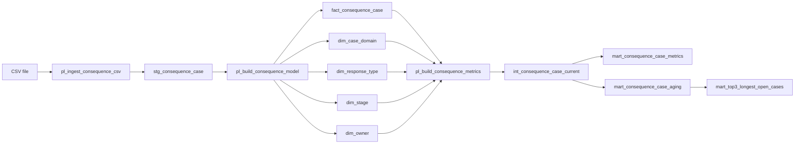

# PIPELINE_SPEC.md

Project: Consequence Process Dashboard  
Document ID: pipeline_spec  
Priority: P0  
Depends on: DATA_MODEL_SPEC.md, METRIC_LOGIC.md

## Pipeline Overview

### Pipeline Inventory

| Pipeline | Purpose | Source | Destination |
|---|---|---|---|
| `pl_ingest_consequence_csv` | รับ CSV, ตรวจ schema/type เบื้องต้น และสร้าง validated staging snapshot | user-provided CSV | `stg_consequence_case` in DuckDB |
| `pl_build_consequence_model` | materialize fact/dimension tables ตาม `DATA_MODEL_SPEC.md` | `stg_consequence_case` | `fact_consequence_case`, `dim_case_domain`, `dim_response_type`, `dim_stage`, `dim_owner` |
| `pl_build_consequence_metrics` | สร้าง semantic views/marts ตาม SQL logic ใน `METRIC_LOGIC.md` | fact/dimension tables + approved runtime inputs | `int_consequence_case_current`, `mart_consequence_case_metrics`, `mart_consequence_case_aging`, `mart_top3_longest_open_cases` |

### Pipeline DAG

### Technology Stack

- **Storage / analytics engine:** `DuckDB`
- **Transformation execution:** Python orchestration + DuckDB SQL
- **Source format:** CSV
- **Deployment:** Coolify
- **Source control:** company repository
- **Coding agent:** Claude Code or Codex
- **Dashboard framework:** `null`
  - **Owner:** Candidate / Implementation Owner
  - ยังไม่ได้ล็อกจากโจทย์
- **External scheduler:** not required for core exam flow; ingestion is on-demand/manual

## Pipeline Definitions

### `pl_ingest_consequence_csv`

- **Purpose:** validate source shape and load one dataset snapshot into staging
- **Source:** CSV upload/file
- **Transform Tool:** Python + DuckDB CSV reader / SQL
- **Transformation Steps:**
  1. verify required headers from `DATA_CONTRACT.md`
  2. reject unreadable file
  3. parse `stage_entered_date` to DATE
  4. preserve identifiers as VARCHAR
  5. detect duplicate `case_id`
  6. detect categorical values outside current source contract
  7. materialize validated rows into `stg_consequence_case`
- **Destination:** `stg_consequence_case`
- **Schedule (cron):** `null`
- **Trigger:** on-demand when user submits/loads CSV
- **Schedule Calibration Owner:** Exam Setter / Product Owner if recurring operation is required later
- **Dependencies:** none
- **Error Handling:** schema/type/duplicate failure blocks downstream model build and returns validation result

### `pl_build_consequence_model`

- **Purpose:** populate every fact/dimension table declared in `DATA_MODEL_SPEC.md`
- **Source:** `stg_consequence_case`
- **Transform Tool:** DuckDB SQL orchestrated by Python
- **Transformation Steps:**
  1. derive distinct `case_domain` rows into `dim_case_domain`
  2. derive distinct `response_type` rows into `dim_response_type`
  3. derive distinct `stage` rows into `dim_stage`
  4. derive distinct `owner` rows into `dim_owner`
  5. resolve deterministic dimension keys
  6. populate `fact_consequence_case`
  7. verify all FKs resolve
- **Destination:** semantic fact/dimension tables
- **Schedule (cron):** `null`
- **Trigger:** immediately after successful `pl_ingest_consequence_csv`
- **Schedule Calibration Owner:** Exam Setter / Product Owner if recurring operation is required later
- **Dependencies:** [`pl_ingest_consequence_csv`]
- **Error Handling:** any failed dimension resolution or fact load aborts this pipeline and prevents metric build

### `pl_build_consequence_metrics`

- **Purpose:** implement all analytics transformations from `METRIC_LOGIC.md`
- **Source:** `fact_consequence_case`, `dim_case_domain`, `dim_response_type`, `dim_stage`, `dim_owner`
- **Transform Tool:** DuckDB SQL orchestrated by Python
- **Transformation Steps:**
  1. create/refresh `int_consequence_case_current`
  2. create/refresh `mart_consequence_case_metrics`
  3. create/refresh `mart_consequence_case_aging`
  4. create/refresh `mart_top3_longest_open_cases`
- **Destination:** analytics views/marts consumed by dashboard
- **Schedule (cron):** `null`
- **Trigger:** immediately after successful `pl_build_consequence_model`
- **Dependencies:** [`pl_build_consequence_model`, approved business/runtime inputs when required]
- **Error Handling:** metrics that require a runtime input that is missing (e.g. `reference_date`) or invalid must remain unavailable/pending rather than silently substituting defaults; approved values for this exam are listed in `METRIC_LOGIC.md`

## Source Systems

### `consequence_case_csv`

- **Source System Name:** mock consequence-process CSV
- **Source Type:** file / CSV
- **Extraction Method:** direct CSV ingestion
- **Contract Owner:** `DATA_CONTRACT.md`
- **Expected Columns:** governed by `DATA_CONTRACT.md`
- **Authentication:** none for local uploaded mock file
- **Schema Version Signal:** source file itself has no independent version signal
- **Schema Drift Detection:** pipeline pre-ingest comparison against the required fields, types, and categorical source contract in `DATA_CONTRACT.md`
- **Event Stream:** not applicable
- **CDC:** not applicable

### Optional AI Source / Destination

AI workflow is bonus scope and is **not a source for core analytics metrics**.

- **System:** company-provided AI endpoint
- **Type:** API
- **Endpoint:** `null`
- **Authentication method:** `null`
- **Quota:** `null`
- **Owner:** Company AI Platform Owner
- **Use:** generate Process Improvement Brief from approved aggregate analytics output only
- **Dependency:** core analytics pipeline must succeed first

## Error Handling and Retry

### Error Classification

#### Transient Errors

Examples:
- temporary filesystem/read issue
- temporary DuckDB lock/contention
- temporary network timeout to optional AI endpoint
- optional AI endpoint rate limiting

Handling:
- retry is allowed only when the error can plausibly succeed without changing input/configuration
- exact retry count and backoff interval: `null`
- **Calibration Owner:** Candidate / Platform Owner
- after retries are exhausted, surface failure and stop affected downstream step

#### Permanent Errors

Examples:
- required CSV column missing
- invalid date that cannot be parsed
- duplicate `case_id` violating snapshot grain
- categorical value outside current contract
- unresolved FK
- missing approved `reference_date` when aging metric is requested
- invalid/expired credential to optional API
- contract/schema breaking change

Handling:
- do not blind-retry
- block affected downstream pipeline
- report validation reason
- require correction, contract update, or owner approval before rerun

### Authentication Failure

Authentication failure is treated as a permanent configuration/security error for that run:
- alert immediately
- do not wait for generic retry exhaustion
- never print secret values into logs

### Intended RUNBOOK Reconciliation

เมื่อสร้าง `RUNBOOK.md` ภายหลัง ต้องมี scenarios อย่างน้อยสำหรับ:
- CSV schema contract violation
- duplicate business key
- invalid `stage_entered_date`
- DuckDB write/load failure
- metric runtime input missing
- optional AI endpoint authentication/rate-limit failure

## Credentials & Secret Management

### Core CSV + DuckDB

- local CSV ingestion: no source credential required
- embedded DuckDB file: no remote database credential required for exam implementation
- filesystem access must be limited to application runtime paths

### Company Repository

- credential/token value must never be committed to repo
- authentication should use the company's approved developer/deployment mechanism
- exact secret store: `null`
- **Calibration Owner:** Company Repository Administrator
- rotation cadence: `null`
- **Calibration Owner:** Company Repository Administrator

### Coolify Deployment

- runtime secrets must be supplied via Coolify-managed environment secrets/variables, not source code
- only deployment/runtime identities that require a secret may read it
- exact access-role mapping: `null`
- **Calibration Owner:** Company Platform Owner
- rotation cadence: `null`
- **Calibration Owner:** Company Platform Owner
- deployment must not echo secret values into build/runtime logs

### Optional AI Endpoint

- secret store: Coolify-managed environment secret/variable for deployed application
- credential value: never documented or committed
- service identity: least privilege for Process Improvement Brief endpoint only
- allowed readers by environment: `null`
- **Calibration Owner:** Company AI Platform Owner
- rotation cadence: `null`
- **Calibration Owner:** Company AI Platform Owner
- auth failure must alert immediately and must not expose token contents

## Load Strategy

### `pl_ingest_consequence_csv`

- **Load Mode:** full snapshot replacement
- **Reason:** source supplied by exam is a complete CSV snapshot; no `updated_at`/sequence cursor exists
- **Watermark / Cursor:** not applicable for current snapshot contract
- **Upsert Key:** `case_id`
- **Idempotency:** the same validated input snapshot must produce the same staging content when rerun
- **Backfill Window:** not applicable for core snapshot load
- **Snapshot Identity:** implementation should record a deterministic file/run identifier (for example file hash or run ID) without changing business grain

### `pl_build_consequence_model`

- **Load Mode:** rebuild from validated staging snapshot
- **Watermark / Cursor:** inherited snapshot; no source incremental cursor
- **Upsert / Uniqueness Key:** `case_id` for fact business uniqueness; dimension business keys per `DATA_MODEL_SPEC.md`
- **Idempotency:** dimension keys and fact output must be deterministic for the same staging snapshot
- **Backfill:** rerun from a selected validated snapshot rather than appending duplicate facts

### `pl_build_consequence_metrics`

- **Load Mode:** recreate views / refresh derived marts from current semantic model
- **Watermark / Cursor:** not applicable
- **Upsert Key:** not applicable for views; ranked aging output inherits `case_id`
- **Idempotency:** same fact/dim snapshot + same approved runtime inputs must return the same metrics
- **Backfill:** historical metric restatement is not enabled in core exam scope because source history is not available

### Safe Re-run Rule

A failed run may be restarted only from a known validated stage:
1. raw CSV validation
2. staging snapshot
3. semantic model
4. metric marts

Downstream tables/views must not be published partially. If an upstream step fails, the previous valid state remains the only publishable state.

### Schema Drift Rule

Before every CSV ingestion:
- compare headers to `DATA_CONTRACT.md`
- validate parseability of required data types
- detect unexpected categorical values
- detect duplicate `case_id`
- classify extra/missing fields as additive or breaking according to `DATA_CONTRACT.md`

Breaking drift blocks ingestion. Detailed `rule_severity` and SQL assertions are owned by the downstream `DATA_QUALITY.md`, not this document.

### Intended ANALYTICS_CHANGELOG Reconciliation

เมื่อสร้าง `ANALYTICS_CHANGELOG.md` ภายหลัง ต้องบันทึกการเปลี่ยนที่กระทบ:
- source schema
- load strategy
- business key/grain
- metric transformation logic
- runtime rule mapping ที่เปลี่ยนผล metric
