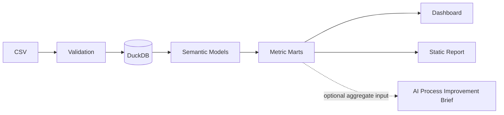

# README.md

## Project Name and Description

# Consequence Process Dashboard

Analytics dashboard สำหรับ HR เพื่อรับ CSV ของ Consequence Process, validate และจัดเก็บใน DuckDB จากนั้นแสดง Total Cases, Closed Cases, Open Cases, Open Cases by Stage, case aging และ Top 3 longest-open cases พร้อม filter ระหว่าง `behavior` และ `performance`

โปรเจกต์ใช้ `ddd-data-analytics` เป็น blueprint หลัก และแยก business definition, metric logic, pipeline, quality, testing, dashboard และ governance ออกจากกันอย่างชัดเจน

## Quick Start

> คำสั่งด้านล่างเป็น target command interface สำหรับ implementation ของโปรเจกต์ หากชื่อ script ใน repo จริงต่างจากนี้ ให้ปรับ README ให้ตรงกับ command ที่ทดสอบแล้วก่อนส่งงาน

1. ตรวจ environment
```bash
python --version
```
ผลที่สังเกตได้: แสดง Python version ที่ติดตั้ง

2. ติดตั้ง dependencies
```bash
pip install -r requirements.txt
```
ผลที่สังเกตได้: dependencies ติดตั้งสำเร็จโดยไม่มี unresolved package error

3. รัน validation + load mock CSV
```bash
python app.py --load data/looktal_consequence_mock_2-3MB.csv
```
ผลที่สังเกตได้: validation ผ่านและ DuckDB artifact ถูกสร้าง/อัปเดต

4. รัน tests
```bash
pytest -q
```
ผลที่สังเกตได้: blocking tests ผ่าน

5. รัน application
```bash
python app.py
```
ผลที่สังเกตได้: application start และ dashboard endpoint เปิดได้

6. ตรวจ core dashboard
- เห็น Total / Closed / Open cards
- เห็น Open Cases by Stage
- เลือก `behavior` หรือ `performance` ได้
- เห็น case aging / Top 3 เมื่อ approved runtime inputs พร้อม

## Prerequisites

ค่ารุ่นที่ “ทดสอบแล้วจริง” ยังไม่มีหลักฐานในเอกสาร upstream จึงห้ามเขียนว่า latest หรือเดารุ่น

- Python version: `null`
- DuckDB package version: `null`
- dashboard framework/version: `null`
- pytest version: `null`
- Coolify environment/version: `null`

Owner สำหรับเติม tested versions: Candidate / Implementation Owner หลังรันจริงใน repo

สิ่งที่ต้องมี:
- Python runtime
- company repository access
- Coolify deployment access
- mock CSV
- approved `reference_date` — งานสอบนี้ใช้ `2026-10-01` เป็น project-specific exam assumption (ไม่ใช่ industry standard และไม่ใช่ค่าที่ระบุใน exam brief ต้นฉบับ) กำหนดใน `config/runtime_config.json`
- approved open/closed rule: `closed` = `stage = 'closed'`; `open` = `stage IN ('reviewing', 'follow_up', 'collecting_info')`
- approved day-count: `DATE_DIFF('day', stage_entered_date, reference_date)`; Top 3: `days_in_current_stage DESC, case_id ASC`
- กติกาข้างต้นและ `reference_date` เป็น project-specific approved business rules/assumption สำหรับงานสอบ (approved 2026-10-02) ไม่ใช่ industry standard

## Installation

```bash
git clone <company-repository-url>
cd <repository-directory>
pip install -r requirements.txt
```

ค่าต่อไปนี้ยังเป็น `null` จนบริษัทให้จริง:
- repository URL
- Coolify project/environment/domain
- optional AI endpoint credential

ห้าม commit secret ลง repository

## Usage

Core flow:

```text
CSV
→ schema/data validation
→ DuckDB staging
→ fact/dimension model
→ metric marts
→ dashboard
```

Dashboard รองรับ:
- Total Cases
- Closed Cases
- Open Cases
- Open Cases by Stage
- `days_in_current_stage`
- Top 3 Longest Open Cases
- `case_domain` filter

ข้อควรระวัง:
- ห้ามใช้ system date แทน approved `reference_date`
- metric ที่ business rule ยังไม่ approved ต้องแสดง pending/unavailable
- invalid CSV run ต้องไม่ overwrite previous valid published state
- optional AI Process Improvement Brief ไม่ใช่ automated HR decision

## Architecture Overview



Canonical documents:
- `STAKEHOLDERS.md`
- `KPI_DICTIONARY.md`
- `METRIC_SPEC.md`
- `DATA_MODEL_SPEC.md`
- `METRIC_LOGIC.md`
- `PIPELINE_SPEC.md`
- `DATA_QUALITY.md`
- `TESTING_STRATEGY.md`
- `DASHBOARD_SPEC.md`
- `RUNBOOK.md`

## Contributing

ก่อนแก้ code หรือ analytics logic ให้อ่าน `AGENTS.md` ก่อนเสมอ

Contribution rules:
1. อย่าสร้าง metric formula ซ้ำใน dashboard
2. update canonical owner document ก่อนเมื่อ definition เปลี่ยน
3. breaking change ต้องทำ impact analysis และ update `ANALYTICS_CHANGELOG.md`
4. เพิ่ม/แก้ tests สำหรับ behavior ที่เปลี่ยน
5. ห้าม commit secrets
6. รัน blocking test suite ก่อน push
7. รักษา previous valid state เมื่อ migration/pipeline run fail

Definition of Done ใน `TASKS.md` ต้อง reconcile กับ `AGENTS.md`

## License

License สำหรับ company repository: `null`

**Owner:** Company Repository Administrator / Legal Owner

ห้ามเดา open-source license หาก repository บริษัทไม่ได้ระบุ license อย่างเป็นทางการ
